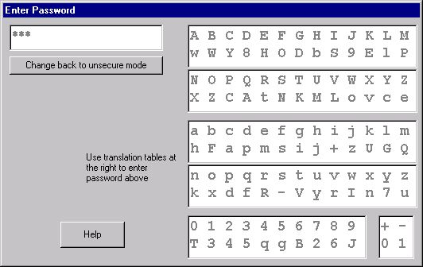



## \[Foil Password Loggers\]

### Description

Foil Password Loggers

FPLv1.FRM is a form you can use to obtain a password from the user in a way that key loggers and people looking over your shoulder cannot capture the password.

It comes up as a normal small password entry box with the prompt "Use secure password entry method". If you are on a secure computer and nobody is looking, you just enter your password as usual.

BUT if the situation demands, you click to get the expanded display shown here.

Now let's say you are entering "Fz34M" (your real password) and you've entered "Fz3" so far. You will have actually typed some bogus stuff like "YEm" and you are looking at three asterisks. Someone is watching you. Here, for example, is what happens next:

You know the next character of your password is "4". You glance at the panel showing A-Z, a-z, 0-9 and quickly locate "4" and you see that to enter "4" you must type "q".

Ok, you type "q". The person spying might actually see you hit the "q", but immediately the screen changes and she doesn't have time to scan the 62 random characters to find out that it means "4".

Now the next time you use the program, "4" won't necessarily be "q". It is a random pick of the 62 characters.

That's the idea. The 62 characters are encrypted. Any other characters just stay as is. For example if your password is "m,@37" then one day you might enter "Q,@j8" and another day you enter "p,@9Y".

There was one problem with the original design. The letter "O" and the digit "0" look alike. So does little L (l) and one (1). This was error prone, so the characters "+" and "-" (what else?) were used in the encryption. This meant that if your password actually had one of those characters, you couldn't enter it. To get around that, "+" is always entered as zero (0) and "-" is entered as one (1).
 
### More Info
 

             |
---                |---
**Submitted On**   |2005-01-22 16:22:32
**By**             |[QBasic Mac](https://github.com/Planet-Source-Code/PSCIndex/blob/master/ByAuthor/qbasic-mac.md)
**Level**          |Advanced
**User Rating**    |4.8 (38 globes from 8 users)
**Compatibility**  |VB 5\.0
**Category**       |[Encryption](https://github.com/Planet-Source-Code/PSCIndex/blob/master/ByCategory/encryption__1-48.md)
**World**          |[Visual Basic](https://github.com/Planet-Source-Code/PSCIndex/blob/master/ByWorld/visual-basic.md)
**Archive File**   |[\[Foil\_Pass1843021222005\.zip](https://github.com/Planet-Source-Code/qbasic-mac-foil-password-loggers__1-58444/archive/master.zip)

